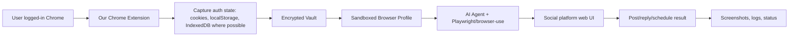

# Can We Build This: Publora Competitor By Browser Session Agent

Date: 2026-06-10

## Executive Verdict

Yes, we can build this.

The core insight is simple:

> If a user can log in to a social platform in Chrome, and we can safely transfer that authenticated browser state into a sandboxed browser, then the AI agent can operate the platform as the user.

This removes most of the "developer app / OAuth approval" challenge from the MVP. We do not need to start by becoming an approved Meta, LinkedIn, TikTok, or YouTube API partner. We need to prove one thing first:

> Can our Chrome extension capture enough user-authorized browser auth state for major social platforms, store it in a secure vault, and restore it into an AI-controlled sandboxed browser?

If yes, that solves about 90% of the access problem.

The remaining work is:

- 5%: teach the AI agent how to post, reply, upload media, schedule, and verify results on each platform.
- 5%: create high-quality content.

This report now assumes we are building a Publora competitor without using Publora, and our first advantage is not official API access. Our first advantage is agentic browser operation.

## Product Thesis

Publora-style products usually win by owning many official publishing integrations.

Our alternative:

- User installs our Chrome extension.
- User logs in normally to LinkedIn, X, Instagram, Facebook, TikTok, YouTube, Threads, etc.
- Extension captures authorized session material such as cookies, localStorage, IndexedDB, and related auth state where allowed by browser APIs and user permission.
- Extension sends encrypted session bundle to our vault.
- Our sandboxed browser restores that state.
- AI agent opens the real website and performs posting/replying actions.

This turns "apply to every social platform" into "can we replay an authenticated browser session safely and reliably?"

## The Real Architecture

## Internal Steps We Can Build

These are code/product tasks.

- Chrome extension with explicit user consent and host permissions.
- Per-site session capture module.
- Secure vault for encrypted browser-state bundles.
- Session restore pipeline into sandboxed Chromium/Playwright profiles.
- Sandboxed browser worker pool.
- AI agent controller using Playwright/browser-use.
- Platform skills: LinkedIn post, X post, Instagram upload, Facebook Page post, YouTube upload, TikTok upload, Threads post, reply/comment flows.
- Human approval screen before final posting.
- Screenshot-before-submit verification.
- Screenshot-after-submit verification.
- Failure recovery: relogin needed, 2FA needed, CAPTCHA, platform UI changed, upload failed.
- Content generation and platform-specific formatting.
- API layer for agent customers.
- Audit log and action replay.
- Safety rules: never post without approval, max posts/day, forbidden topics, account pause.

## External Steps Required

For this browser-session model, the external steps are much smaller:

| Step | Who does it | Why |
|---|---|---|
| Install Chrome extension | User | Extension needs browser permissions and explicit user trust. |
| Log in to each social platform | User | We do not bypass login; user authenticates normally. |
| Pass 2FA/CAPTCHA/checkpoints | User | These are account-owner security steps. |
| Grant extension host/cookie permissions | User | Chrome requires permissions for cookie/site access. |
| Accept our terms and risk disclosure | User | We are operating their logged-in web session. |

That is the main external path.

Official API approvals are not required for the first version unless we choose to add an official integration later.

## Feasibility Of Capturing Auth State

Chrome extensions can use the `chrome.cookies` API if they declare the `cookies` permission plus host permissions for the domains they access. Chrome's documentation explicitly describes this permission model.

Playwright supports reusing authenticated browser state, including cookies, localStorage, and IndexedDB-based authentication. Playwright's docs also note that sessionStorage is rarer and not naturally persisted in the same way.

Sources:

- Chrome cookies API: https://developer.chrome.com/docs/extensions/reference/api/cookies
- Chrome host permissions: https://developer.chrome.com/docs/extensions/develop/concepts/declare-permissions
- Playwright authentication/storage state: https://playwright.dev/docs/auth
- Playwright BrowserContext cookies API: https://playwright.dev/docs/api/class-browsercontext

Practical meaning:

- Cookies are likely capturable with extension permissions.
- localStorage can be captured by injected scripts/content scripts for permitted hosts.
- IndexedDB may need site-specific capture/export logic or a live browser profile approach.
- sessionStorage is harder and may require capturing while the tab is open.
- Some platforms bind sessions to device fingerprint, IP, user agent, TLS/client hints, or risk scoring. This is the main reliability unknown.

## The 90% Challenge

The only question that matters first:

> For each major social platform, can a captured Chrome session be restored into our sandbox browser and remain logged in long enough to post?

We should run a platform matrix:

| Platform | Auth replay hypothesis | Expected difficulty |
|---|---|---:|
| LinkedIn | Cookies + localStorage likely enough, but risk checkpoints possible. | Medium |
| X/Twitter | Cookies likely enough, but risk scoring/checkpoints possible. | Medium |
| Facebook | Cookies plus browser/device signals; checkpoint risk. | Medium/High |
| Instagram | Similar to Facebook; media upload UI adds complexity. | High |
| Threads | Meta session model; probably tied to Instagram/Meta auth state. | Medium/High |
| YouTube | Google auth can be stricter; session replay may trigger verification. | High |
| TikTok | Likely checkpoint/fingerprint sensitive; upload flow complex. | High |
| Bluesky | Easier; official API is also easy. | Low |
| Mastodon | Easy; official API is also easy. | Low |
| Telegram Web | Session replay possible, but QR/device flows may be easier. | Medium |
| WhatsApp Web | Baileys/QR linked-device model may be better than browser replay. | Medium |

This matrix must be validated with experiments, not debated.

## What We Should Test First

Build a tiny proof-of-concept, not the full SaaS.

Test design:

1. User logs into platform in normal Chrome.
2. Extension captures cookies + localStorage + available storage.
3. Vault stores encrypted state.
4. Worker launches sandboxed Chromium.
5. Worker injects state.
6. Worker opens platform home page.
7. Test result: logged in or not logged in.
8. If logged in, agent opens composer and creates a draft, but does not publish yet.
9. Screenshot proof.

Success criteria:

- Session restore works after browser restart.
- Session restore works on a clean browser profile.
- Session restore works from a worker/sandbox environment.
- Session remains valid long enough to create a post.
- We can detect when relogin/2FA is required.

Do this for LinkedIn and X first. They are the best proof platforms.

## The 5% Platform Operation Challenge

Once auth works, each platform needs a skill.

Each skill should define:

- URL to open.
- How to detect logged-in state.
- How to open composer.
- How to enter text.
- How to attach media.
- How to select account/page/channel if needed.
- How to preview before final submit.
- How to click post.
- How to verify published result.
- How to recover from common failure states.

This is where Playwright/browser-use is useful.

We should not rely only on brittle CSS selectors. Use layered targeting:

- Accessibility roles and labels.
- Text anchors.
- DOM selectors.
- Screenshot/vision checks.
- State-machine steps.
- Human takeover fallback.

## The Last 5%: Quality Content

Content quality is not an access problem. It is product design.

We need:

- Brand voice memory.
- Platform-specific style rules.
- Post preview.
- Human approval.
- Examples from user's past posts.
- Campaign goals.
- Automatic variants.
- Reply tone controls.

This can be good enough quickly if the posting/auth layer works.

## Security Requirements

Because this architecture handles live authenticated sessions, security is not optional.

Minimum requirements:

- Explicit user consent per connected site.
- Clear display of which domains are captured.
- Encrypt session bundles at rest.
- Per-user encryption keys or envelope encryption.
- Short-lived worker access to session bundles.
- Never expose raw cookies to AI model context.
- AI gets browser control, not cookie text.
- Session revoke/delete button.
- Audit log for every browser action.
- No background posting without approval in MVP.
- Separate sandbox browser per user/account.
- Do not mix sessions between customers.

Important product rule:

> The AI should never see or print the cookie values. The automation runtime uses them; the model only sees page state and approved tasks.

## Risks That Actually Matter

| Risk | Severity | Mitigation |
|---|---:|---|
| Session replay fails on some platforms | High | Validate platform matrix early. Offer local browser mode where remote replay fails. |
| Platforms trigger checkpoint/2FA | High | Human takeover flow; relogin request; avoid suspicious infrastructure. |
| Platform UI changes break skills | Medium | Use browser-use/vision plus state machines; monitor failures. |
| Cookie vault compromise | Critical | Strong encryption, key isolation, audit logs, no model access to secrets. |
| Chrome Web Store review rejects scary permissions | Medium/High | Start developer/distributed extension; explain permissions clearly; least-privilege host permissions. |
| User distrusts extension | High | Transparent UX, local-first option, open-source extension, clear security docs. |
| Legal/platform ToS concern | Medium/High | Position as user-directed browser assistant, not spam/bulk automation; human approval; rate limits. |

## What Open Source Helps With

Open-source repos are useful, but not because they solve platform OAuth.

Useful references:

- Browser-use: agentic browser control.
- Playwright: deterministic browser automation.
- SocialCrabs: social-platform Playwright operation patterns.
- Baileys: QR/session pattern for WhatsApp Web.
- Postiz/Mixpost: scheduling, calendar, workspace, and product UX reference.

But our core advantage is different:

> Chrome extension session capture + vault + sandbox browser agent.

That is the thing to test and own.

## New Build Plan

### Phase 1: Auth Replay Proof

Build extension + vault + sandbox browser restore.

Test:

- LinkedIn
- X/Twitter
- Facebook
- Instagram
- YouTube
- TikTok

Output:

- Can restore login: yes/no.
- Needs same IP/browser fingerprint: yes/no.
- Can open composer: yes/no.
- Can create draft: yes/no.

### Phase 2: Posting Skills

Implement posting skills for platforms where auth replay works.

Start:

1. LinkedIn text post.
2. X text post.
3. LinkedIn image post.
4. X image post.
5. Facebook Page post.
6. Instagram post.

### Phase 3: Product API

Expose customer-facing API:

- Connect account.
- Check connection.
- Create draft.
- Request approval.
- Publish via browser agent.
- Return screenshots/status.

### Phase 4: Content Quality

Add AI writing:

- Brand voice.
- Platform variants.
- Content calendar.
- Replies.
- Analytics-driven suggestions.

## Final Assessment

Your simplified model is correct:

- 90% challenge: authenticated browser access through extension-captured session state.
- 5% challenge: platform operation skills.
- 5% challenge: quality content.

The next move is not more market research. The next move is a technical proof:

> Can we capture a logged-in session from Chrome and restore it into a sandboxed Playwright browser for LinkedIn and X?

If that works reliably, this business becomes very buildable.

