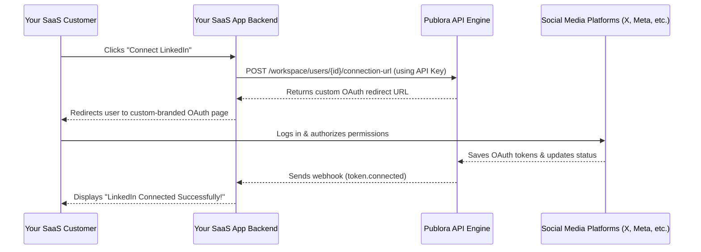
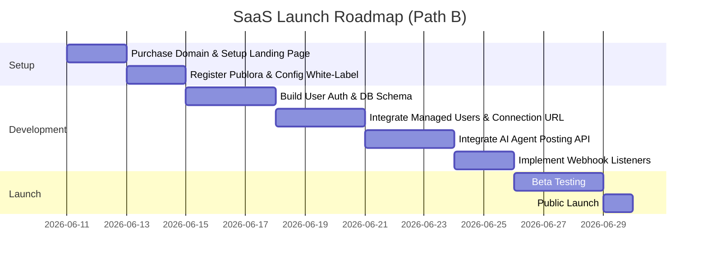

# Viability Assessment Report: AI Agent Social Media Posting SaaS
**Author:** AI Coding Assistant  
**Date:** June 10, 2026  
**Status:** Completed  
**Artifact ID:** Can_We_Build_This1.md  

---

## 1. Executive Summary

This report evaluates the technical and business viability of starting a SaaS that allows users to authorize their social media accounts and let an AI agent schedule and publish posts on their behalf. 

The core bottleneck of this SaaS is **social media authentication (OAuth) and API access**. Connecting to and posting on 10 different social networks requires a complex infrastructure of access tokens, refresh loops, media format conversions, and strict API compliance.

We analyze two paths forward:
1. **Path A (Build from Scratch):** You build the entire OAuth flow and posting engines yourself, connecting directly to Meta, X, LinkedIn, etc.
2. **Path B (Use Publora as Backend Infrastructure):** You wrap the **Publora Workspace/B2B API** to handle the OAuth authentication, token management, and publishing backend under a white-label setup.

> [!IMPORTANT]
> **Verdict:** **Path B (Using Publora's Workspace API) is highly viable and can be built immediately.** 
> Path A is currently **unviable for a bootstrapping founder** due to extreme API licensing costs (specifically X/Twitter's $5,000/month commercial fee) and months-long App Review processes required by Meta and Google. 

---

## 2. Path A vs. Path B: High-Level Comparison

| Metric | Path A: Direct Integration (From Scratch) | Path B: Publora API Wrapper |
| :--- | :--- | :--- |
| **Time to Market** | 3–6 Months (due to App Reviews) | 1–2 Weeks |
| **Initial Cost** | **High** (Upfront developer time + developer registrations) | **Low** ($49/month workspace subscription) |
| **X/Twitter API Cost** | **$5,000 / month** (Pro plan required for commercial SaaS) | **$2.99 / account** (Paid via Publora tier) |
| **App Review Hurdles** | **High** (Meta, Google, & TikTok reviews require business verification & recordings) | **None** (Publora has already passed reviews with Meta/Google) |
| **Maintenance Overhead**| **Constant** (Handling API changes, rate limits, token refresh bugs) | **Zero** (Publora handles API maintenance) |
| **White-Labeling** | 100% native | Yes, via Publora Custom Domains & White-labeling |

---

## 3. Detailed Breakdown: Path A (Direct APIs / From Scratch)

Building the OAuth and posting engine from scratch means you are the primary developer application registered with all the major social networks.

### Internal Steps (What an AI developer can write 100%)
* **OAuth Controllers:** Creating callback endpoints (`/api/auth/callback/x`, `/api/auth/callback/facebook`, etc.) to intercept redirect authorization codes and exchange them for access tokens.
* **Token Storage:** Designing a highly secure Database schema using encryption (AES-256) to store Client Secrets, Access Tokens, and Refresh Tokens.
* **Refresh Worker:** Setting up a cron job/background worker (using BullMQ, Celery, or Cron) that checks token expirations and calls refresh endpoints before they expire (e.g., LinkedIn tokens last 60 days, Meta tokens last 60 days but need exchanges).
* **Posting Adapters:** Writing platform-specific API clients to translate generic post payloads (content + image) into platform-specific structures:
  * *X (Twitter):* Standard REST v2 post endpoint.
  * *Instagram/Facebook:* Meta Graph API (requires page access tokens and media container workflows).
  * *LinkedIn:* UGC Post API (requires organization or personal URN structures).
* **Media Processing Engines:** Compressing, resizing, and transforming user-uploaded images and videos into platform-specific formats (e.g., TikTok has strict aspect ratio/length requirements; Instagram requires specific aspect ratios for Reels).

### External Steps (What you, the USER, must do manually)
* **Company Setup:** Registering a legal company (LLC or equivalent). Meta and Google require legal business verification to access production scopes.
* **Domain & Policy Pages:** Setting up a live domain with public-facing **Privacy Policy** and **Terms of Service** pages (must contain specific clauses regarding data usage, which are checked by Meta/Google reviewers).
* **Platform Developer Account Applications:**
  * **Meta Developer Portal (Facebook, Instagram, Threads):** Create an app, complete Meta Business Verification (requires uploading company registration documents, utility bills, and obtaining a Dun & Bradstreet (D-U-N-S) number).
  * **LinkedIn Developer Portal:** Request access to the "Share on LinkedIn" and "Sign In with LinkedIn" products.
  * **X (Twitter) Developer Portal:** Apply for developer access. You will be restricted to the Free/Basic tier (write-only, very low limits). For a commercial SaaS, you **must purchase the Pro Tier ($5,000/month)**.
  * **TikTok for Developers:** Set up a developer profile and submit your app for review.
  * **Google Developer Console (YouTube):** Setup OAuth screen and apply for verification to remove the "unverified app" warning for users linking YouTube.
* **App Review Audits:** For Meta, Google, and TikTok, you must record video walkthroughs showing exactly how your application logs the user in, how the AI agent creates posts, and how the posts are published. 

---

## 4. Detailed Breakdown: Path B (Using Publora Workspace API)

Under this path, your application is a client of Publora. You act as an "Agency" or "Workspace Provider". When a customer signs up on your app, you create a "Managed User" under your Publora developer account.



### Internal Steps (What an AI developer can write 100%)
* **Managed User Provisioning:** Write a backend hook during user sign-up that sends a request to Publora to create an isolated `managed user` ID.
  ```javascript
  // Triggered when a new user registers on your platform
  const publoraUser = await fetch('https://api.publora.com/api/v1/workspace/users', {
    method: 'POST',
    headers: { 'x-publora-key': process.env.PUBLORA_API_KEY },
    body: JSON.stringify({ email: newUser.email, name: newUser.name })
  });
  ```
* **OAuth Link Generation:** Generate a custom-branded OAuth session link using the Workspace API and serve it to the client:
  ```
  POST https://api.publora.com/api/v1/workspace/users/${managedUserId}/connection-url
  ```
* **Display Active Connections:** Call Publora's connections endpoint, passing the managed user's ID in the header to display which channels are linked:
  ```javascript
  // Fetch active channels for a specific customer
  const response = await fetch('https://api.publora.com/api/v1/platform-connections', {
    headers: {
      'x-publora-key': process.env.PUBLORA_API_KEY,
      'x-publora-user-id': customer.publoraManagedUserId
    }
  });
  ```
* **AI Scheduler & Poster:** Connect your AI agent (Gemini, Claude, or GPT) to your app's frontend. When the AI agent decides to publish or schedule a post, your backend issues a single JSON post call to Publora:
  ```javascript
  const postResponse = await fetch('https://api.publora.com/api/v1/create-post', {
    method: 'POST',
    headers: {
      'Content-Type': 'application/json',
      'x-publora-key': process.env.PUBLORA_API_KEY,
      'x-publora-user-id': customer.publoraManagedUserId
    },
    body: JSON.stringify({
      content: aiAgentGeneratedText,
      platforms: ['linkedin-ABC123', 'twitter-123456'],
      scheduledTime: "2026-06-12T10:00:00.000Z"
    })
  });
  ```
* **Webhook Receiver:** Set up a webhook endpoint (`/api/webhooks/publora`) to listen to notifications like `post.published` or `post.failed`. Update your app database to reflect these states in your customer dashboard.

### External Steps (What you, the USER, must do manually)
* **Create a Publora Account:** Register on [publora.com](https://publora.com).
* **Subscribe to a Pro/Workspace Plan:** Subscribe to a plan that enables API Access and Workspace/Managed User features ($49/mo Starter or custom pricing).
* **Custom Domain / Branding Setup:**
  * Configure your CNAME records on your domain (e.g., set up `auth.yoursaas.com` pointing to Publora's connection servers).
  * Upload your logo and brand colors in the Publora dashboard. This ensures that when your users connect their social media accounts, they see *your* brand and domain, not Publora's.
* **Obtain API Key:** Copy the master API key (`x-publora-key`) from the dashboard and store it in your backend's environment variables (`.env`).

---

## 5. Financial Viability and Business Case Analysis

Let's look at the financial math of launching using Path B (Publora API wrapper).

### Costs
* **Fixed Overhead:** $49 / month (Publora Workspace Pro Plan)
* **Variable Cost:** $2.99 / month per connected social account.

### Customer Pricing Strategy Example
If you charge your customers a monthly subscription:
* **SaaS Tier 1: $19 / month**
  * Limit: Connect up to 3 social media accounts (e.g., X, LinkedIn, Instagram).
  * Your variable API cost: $2.99 * 3 = **$8.97**
  * Gross Margin per user: **$10.03 (52.7%)**
* **SaaS Tier 2: $39 / month**
  * Limit: Connect up to 7 social media accounts.
  * Your variable API cost: $2.99 * 7 = **$20.93**
  * Gross Margin per user: **$18.07 (46.3%)**

With just **5 to 10 active customers**, you fully cover the $49/mo fixed workspace cost and operate at a profit. 

By contrast, to build Path A from scratch, you would need to cover **$5,000/month** for the X API alone from day one. You would need **at least 250+ paying users** just to break even on X API costs.

---

## 6. Action Plan & Next Steps

If you decide to proceed with starting this business, here is the recommended roadmap:



### Next Immediate Action:
If you want to start building this app, we can write the backend skeleton right now. We can:
1. Initialize a Node.js/TypeScript or Next.js app in this workspace.
2. Set up the schema for database users and social accounts.
3. Code the Publora client integration (managed user registration, connection URL retrieval, and post scheduling endpoints).

Let me know if you would like me to start scaffolding this project!
